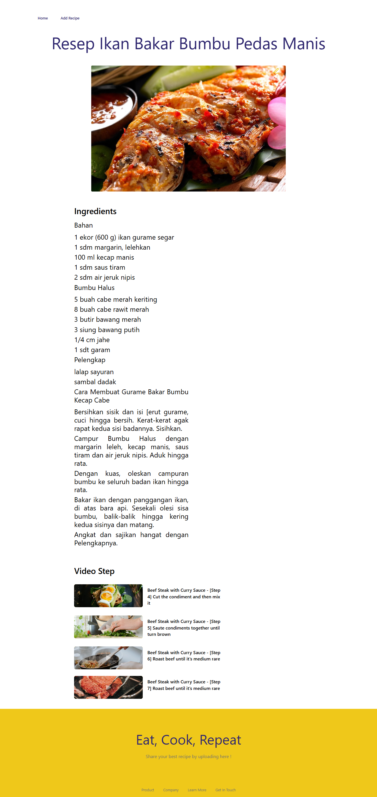

<br />
<div align="center">
  <a href="https://github.com/dimassagngsptr/food-recipe.git">
    
  </a>

  <h1 align="center">Mama Recipe</h1>

  <p align="center">
    Food Recipe Implementation
    <br />
    <br />
    <a href="https://food-recipe-dimas.vercel.app/" target="_blank">View Demo</a>
    ·
    <a href="https://github.com/dimassagngsptr/pijar-mama-recipe.git" target="_blank">View Back-End Repo</a>
  </p>
</div>

## Table of Contents

- [Table of Contents](#table-of-contents)
- [About The Project](#about-the-project)
  - [Built With](#built-with)
- [Getting Started](#getting-started)
  - [Installation](#installation)
  - [Screenshots](#screenshots)
- [Contributing](#contributing)
- [License](#license)
- [Contact](#contact)
- [Documentation](#documentation)
- [Related Project](#related-project)

## About The Project

**Food Recipe** is a food recipe search application that can be accessed by anyone, this application is built using Next.Js with and Tailwind CSS framework as a page design support. In addition, this application emphasizes reusable components to minimize repetitive code. Applying SSR and CSR concepts to build a website with good performance.

### Built With

These are the language, framework and packages to building the web

- [Javascript](https://nodejs.org/en)
- [Next.Js](https://nextjs.org/)
- [Next.Js Pages Router](https://nextjs.org/)
- [Tailwind CSS](https://tailwindcss.com/)
- [Redux Toolkit](https://redux-toolkit.js.org/)
- [Formik and Yup](https://formik.org/)
- [Axios](https://axios-http.com/)
- [Firebase](https://firebase.google.com/)

## Getting Started

### Installation

1. Clone this repository

```sh
git clone https://github.com/dimassagngsptr/food-recipe.git
```

2. Go to folder Food Recipe

Run this command to open the folder

```sh
cd food-recipe
```

Run this command to open your Visual Studio Code

```sh
code .
```

3. Install all of the required modules

using NPM

```sh
npm install
```

using Yarn

```sh
yarn add
```

4.Create file enviroment variable `sh .env ` or `sh .env.local`

```sh
NEXT_PUBLIC_BASE_URL=https://api-food-recipe.com/v1/

BASE_URL=https://api-food-recipe.com/v1/

NEXT_PUBLIC_FIREBASE_API_KEY=your-api-key
```

5. Run this command to run the project

using NPM

```sh
npm run dev
```

using Yarn

```sh
yarn dev
```

6. For testing
   ```sh
   email : dimas@gmail.com
   pass : @Dimas123
   ```

## Screenshots

<table>
  <tr>
    <td>Login Page</td>
    <td>Register Page</td>
  </tr>
  <tr>
    <td></td>
    <td></td>
  </tr>
  <tr>
    <td>Register with Google</td>
    <td>Landing Page</td>
  </tr>
  <tr>
    <td></td>
    <td></td>
  </tr>
  <tr>
    <td>Search Recipe</td>
    <td>Sort Recipe</td>
  </tr>
  <tr>
    <td></td>
    <td></td>
  </tr>
  <tr>
    <td>Detail Recipe</td>
<!--     <td>Video Recipe Page</td> -->
  </tr>
  <tr>
    <td></td>
<!--     <td></td> -->
  </tr>
  <tr>
    <td>My Recipe</td>
    <td>Saved Recipe</td>
  </tr>
  <tr>
    <td></td>
    <td></td>
  </tr>
  <tr>
    <td>Like Recipe</td>
  </tr>
  <tr>
    <td></td>
  </tr> 
</table>

### Contributing

Contributions are what make the open source community such an amazing place to learn, inspire, and create. Any contributions you make are **greatly appreciated**.

1. Fork the Project
2. Create your Feature Branch (`git checkout -b feature/AmazingFeature`)
3. Commit your Changes (`git commit -m 'feat : Add some AmazingFeature'`)
4. Push to the Branch (`git push origin feature/AmazingFeature`)
5. Open a Pull Request

### License

Distributed under the MIT License. See [`LICENSE`](https://github.com/dimassagngsptr/food-recipe/blob/master/LICENSE) for more information.

### Contact

If you have any questions or inquiries regarding this project, feel free to contact me at 

email : dimasageng58@gmail.com

linkedin : https://www.linkedin.com/in/dimasagengsaputro/


### Documentation

The server for this project was created by [muhammad risano](https://github.com/muhammadrisano) using [Express.Js](https://expressjs.com/). If you want to see more about this back-end project, please visit [back-end food-recipe](https://github.com/dimassagngsptr/pijar-mama-recipe.git)

### Related Project

:rocket: [`Food Recipe`](https://github.com/dimassagngsptr/food-recipe.git)
